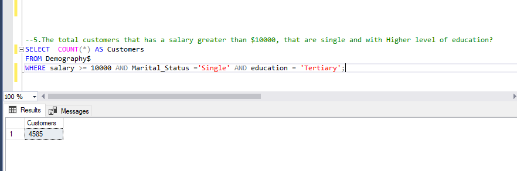

# Sql-Analysis-of-Auto-sales-Coy

## A Descriptive Data Analysis of An Auto Sales Company

### INTRODUCTION
The idea of starting this project came from a data analysis challenge by _***ONYX data_ on Linked-in, as it was through the data set I got from them that I modified to get what I used for this project.
The phase of this analysis project consists of data collection, data exploration, summarizing and aggregating(analysis), segmentation, comparing different groups/demography, and a report.
This project will give insights into auto customers' patterns of behavior and how different variables affect their ability to take/make any decision/choice. This project will also help stakeholders in the industry to understand and plan for how to ensure customer satisfaction and profitability. Although the location on the data set is mostly Brazilian cities, the insights can be applied to almost everywhere in the world.
The data set contains four tables; Contacts, Customers, Demography, and Finance.

### RESOURCES USED
To find the material/data set I used in this analysis, click Here. The data set is stored in a Google drive on my PC. 

### SKILL
As I said above, in this project I employed the use 6 phases which include:
1. Data collection: Part of the data set was collected from the Onyx data challenge website before I added some from a previous project I did to ensure a balance. After that, I cleaned and formatted the necessary column to ensure it was ready for analysis.
2. Data exploration: Process like checking for its size, structure, and different variables contained therein, to see if they can solve some of the pertinent questions I want to answer.
3. Summarizing and aggregating: Used aggregators like SUM, COUNT, MIN, MAX, AVG<, etc., to summarize the data set and understand all the needed patterns.
4. Segmentation: Broke down the data into different customer segments and it helped me understand more about the behaviors, trends, and variations.
5. Report: Wrote a documentation/report on my findings to make recommendations and draw their attention to important issues/challenges and how best to overcome them and move forward.

### TOOLS USED
Excel and SQL: The data collection and part of the cleaning were done with Excel, while the rest of the cleaning and the aggregations(analysis), and segmentation were done with SQL(Structure querying language)).

NB: This project is strictly for descriptive purposes and therefore no visuals are attached.

### PROBLEM STATEMENT
To help the industry/business move forward, I, with the aid of chatGPT crafted from questions that are as follows:

1. What is the distribution in % of customers across gender demographics?

2. How does the age distribution vary among different customers?

3. What is the average salary of customers in each education category?

4. What are the trends in the marital status and education levels of customers?

5. The total customers that have a salary greater than $10000, that are single and with a Higher level of education?

6. How many customers have a housing loan and a balance greater than the average balance?

7. What is the most common education level among customers?

8. What is the average balance for each education level, considering only customers who have housing loans?

9. Who are the customers, their jobs, and a column named 'Job_Status' that shows 'High Income' for customers with a salary greater than $20,000, and 'Low Income' otherwise?

10. Calculate the average balance for customers in each age group, and also show a column named 'Age_Category' with values 'Young' for ages less than 30, 'Middle-aged' for ages between 30 and 50, and 'Senior' for ages 50 and above?

11. What is the job title and education level of the customers who have the highest average balance?

12. What is the Total number of customers that were contacted more than once during the campaign and with a bank balance of at least $ 50,000 with no loans?

13. What is the highest campaign duration for each month of the year that the owners were not targeted previously and had housing loans?

1. How many customers are there in each age group that have a loan? Create 3 age groups(Young, middle-aged, and Seniors) from the age column, dividing the ages into equal proportions.

14. What are the top 3 cities with the highest number of customers who have a balance greater than 10000?

### SOLUTIONS I’M OFFERING:

#### (Q).What is the company’s total number of customers?

_TOTAL NUMBER OF CUSTOMERS:_

With the COUNT() aggregator wrapped inside a SELECT statement, I counted the total numner of customers the business, and they were 45211 people in number.

### (Q). What is the distribution in % of customers across the gender demographics?

_DISTRIBUTION OF CUSTOMERS ACROSS GENDERS:_

To solve this using SQL, there is one variable at play; the gender variable, while segmenting them into different gender demography.
Using the SELECT statement, the FROM, and the GROUP BY clause, I was able to unravel the percentage of the 3 genders that were contained in the Demography table. 33%(15326)were female, 22%(9961) were undecided customers(that’s, they don’t to fall under the other 2 demography and 44%(19924)were males.The total count of customers is 45211 people.

### (Q). How does the age distribution vary among different customers?

_AGE DISTRIBUTION AMONG CUSTOMERS:_

This question looks similar to the number 1 above, but the difference is that the customer age column is the variable at play. 
So, with the SELECT statement, FROM, the GROUP BY, and ORDER BY clause while adding the COUNT() aggregation, I was able to understand the variation of customers ages.
The business had the top 10 of their customers in the 30+ age group with their total number being 14636 customers, that is, 32% of the total customer base.
The 94-year-old with 1 customer is the smallest distribution.

### (Q). What is the average salary of customers in each education category?

_AVERAGE CUSTOMERS SALARY:_

To determine the average salary of customers in the education demography, we look at 2 variables in the demography table, the salary and education columns.
Therefore, with the aid of a SELECT statement, a FROM clause, a GROUP BY, and an ORDER BY clause, while embedding the COUNT()aggregator, I discovered that the customers in the tertiary institution had an average salary of 81795.00. This education category is followed by the secondary customers with 49982.
NB: I used the CEILING() to round the average salary to the nearest hole number.

### (Q). What are the trends in the marital status and education levels of customers?

_TRENDS IN MARITAL STATUS AND EDUCATION LEVEL:_

To solve this using SQL, there are 2 variables at play; the marital status and the education columns.
With a SELECT statement, I picked the 2 columns to display, used the FROM clause to query the Demography table, GROUPED the total customers into marital status and education categories, and ORDERED the list in DESC order.
The result below shows people that were divorced+secondary were 2888, followed by 1518 for people with a mixture of divorced and in tertiary institutions, and the least are the customers that are single and in tertiary with 1060 values.

### (Q). The total customers that have a salary greater than $10000, that are single and with a Higher level of education?

_CUSTOMER SALARY > $10000, SINGLE AND IN TERTIARY INSTITUTION:_

The Salary, status, and education columns are what I would evaluate to get the right answers.
To answer this question, I combined the SELECT statement, the FROM, and the WHERE clause while adding the COUNT() function to the SELECT statement to get the total no of customers.
I counted the no of customers and 4585 customers that matched the criteria of earning at least $10000, being single, and attending tertiary(Higher) institutions.

### (Q). How many customers have a housing loan and a balance greater than the average balance?

_CUSTOMERS WITH LOAN AND BALANCE > AVG BALANCE:_

Answering this question requires a JOIN because it is 2 tables that the info needed to answer the question is contained in. I also created CTE(common table express) for this to ensure query simplicity.
Therefore, with a CTE table, I calculated the average balance and then used the SELECT statement to get the number of customers who have house loans and whose average balance is higher than the average bank balance. Therefore, out of the over 45000 customers, 1206 of them met these criteria.

### (Q). What is the most common education level among customers?

MOST COMMON EDUCATION LEVEL:_

The education level column is the variable at work here.
Therefore, with the COUNT()aggregator inside a SELECT statement, and a FROM, GROUP BY, and an ORDER BY clause, I queried the demography table, and the result below shows that the business had more people who finished secondary education level with 23997 customers(I.e 53%) in their clientele, followed by the customer that finished tertiary institution with 13826 customers. The last in the category is the primary.

### (Q). What is the average balance for each education level, considering only customers who have housing loans?

_AVERAGE BANK BALANCE:_

The education and balance columns are what I needed to query in other to get the correct output.
So, with ROUND(); rounds decimal into your desired decimal place, and the AVG() function inside a SELECT statement, the FROM, the JOIN, the WHERE, and the ORDE BY clause, I was able to query the Demography and Finance tables and I discovered the average balance for each education category, putting into consideration the other criteria was 997(Highest) for the tertiary level certificate holders, followed by 717 for secondary school customers, with the least being 626 for primary school certificate holders.

### (Q). Who are the customers, their jobs, and a column named 'Job_Status' that shows 'High Income' for customers with a salary of at least $20,000, and 'Low Income' otherwise?

__CUSTOMERS, THEIR JOBS, AND ALABEL:_

The question above requires the customer_id, the job, and the salary column to be available in the query to ensure the right output is gotten.
The SELECT(with the CASE WHEN statement embedded), the FROM, and the ORDER BY clauses were needed to answer this simple but tricky question. 
Therefore, I used the SELECT statement to output the needed column, the CASE WHEN to perform the conditional logic in the question, and then the FROM clause to point my query in the direction of the table to search these criteria.
The output shows that more customers were under-earning “High Incomes”(about 90+ percent) than the “Low Income” earners.

### (Q). Calculate the average balance for customers in age group, and also show a column named 'Age_Category' with values 'Young' for ages less than 30, 'Middle-aged' for ages between 30 and 50, and 'Senior' for ages 50 and above?

_BALANCES IN DIFFERENT AGE GROUPS:_

The Age and the Balance columns were the variables I used to get the desired output from the Demography and the Finance Tables.
With the ROUND() and the AVG() function, and a CASE WHEN statement embedded into the SELECT statement, I was able to specify the columns and apply the necessary criterion needed to get the average bank balance for customers in the 3 age group I got from using the CASE WHEN statement. To direct my query to where to look, I employed the FROM clause, used the JOIN clause to combine the 2 tables, and applied the GROUP BY clause.
The result shows that an 84-year-old (Senior member) has the highest average bank balance with $19511, with a 68-year-old (Middle-aged), the closest age-group member with 3196 in the 7th position.

### (Q). What is the job title and education level of the customers who have the highest average balance?

_THE JOB TITLE AND EDUCATION LEVEL:_

The job, education and the balance column are the needed variations to answer the above question.
With the SELECT statement(ROUND and AVG), I selected the desired columns and used the FROM clause to point to the Demography and Finance tables while joining them with a JOIN clause and adding a GROUP BY and ORDER BY clause, I was able to query the database and it showed that “Retired” customer group had the HIGHEST average salary with $2122 and they have a tertiary education certificate.

### (Q). What is the Total number of customers that were contacted more than once during the campaign and with a bank balance of at least $50000 with no loans?

_TOTAL NUMBER OF CONTACTED CUSTOMERS:_

The challenge above can be solved by embedding a DISTINCT COUNT into a SELECT statement to select the desired columns to output, while using the FROM clause to query the Contacts_1$ table, and joining it to the Finance table because the columns needed(contacts_id, balance, and Loans) were in separate tables. With the WHERE clause, I filtered it down to the needed criterion.
The result below shows 26488 were the total number of customers who met the above criteria.

### (Q). What is the highest campaign duration for each month of the year that the owners were not targeted previously and had housing loans?
 
_HIGHEST MONTHLY CAMPAIGN DURATION:_

Variables Required when answering the above question are the Duration, targeted and month column(Customers$ table), and loan and balance(Finance table).
To arrive at the best output, I SELECTED the maximum duration coupled with the month column, JOINED the two tables with a CROSS JOIN, because they both are not related, used the WHERE clause to filter the result, GROUPED the results monthly, and ORDERED them in descending order.
The result showed that October had the highest duration of the last contact, which was 54 minutes. Followed by July with 41 contact duration.

### (Q). How many customers are there in each age group that has a loan? Create 3 age groups(Young, middle-aged, and Seniors) from the age column, dividing the ages into equal proportions.

_CUSTOMERS IN EACH AGE GROUP:_

The age group, loan, a derived columns(age category) are the variables that are at play here, and they are each from the Demography and the Finance tables respectively.
Selecting the age group and the age category columns with the SELECT statement, embedding a CASE WHEN statement, a JOIN, and a WHERE clause as a sub-query in the FROM clause to divide up the age group column into 3 separate equal groups, join the 2 tables and filter for where the customer took a loan. Used GROUP BY clause accordingly, while ORDERING the list in descending order to fetch the highest values first before the lowest.
After following the above steps, I was able to get the output shown in the image below and it signifies that people in the “Young” category had 3675, while the “Mid_aged” had 3565 people, and the “seniors” had 3 people that fulfilled the filtering and grouping criteria applied the query.

### (Q). What are the top 3 cities with the highest number of customers who have a balance greater than 10000?

_TOP 3 CITIES:_

Calculating the top 3 cities in this project requires the use of the geographical location column in the Demography table, and the Balance column in the Finance table.
Used the SELECT() to choose which column to output, the COUNT() to count the total number of the geographical location, the JOIN() to combine the 2 tables(i.e., the Demography $ the Finance tables), the WHERE clause to filter the result, the GROUP BY to divide the result into similar values, the ORDER BY to give the data output an ordered pattern.
The result shows that Sao-Paulo with 136 customers, Para(71), and finally, Minas Garias with 65 customers.

### KEY FINDINGS:
1. One key finding is that the most common customers are people of the male gender. This may be because the company's marketing strategies focus more on attracting this gender.

2. The business has more customers coming from the 30+ age group/category.

3. A higher percentage of the company’s customers are married and have secondary school certificates with 14310 out of 45211 total customers. Does this say anything a their marketing strategy?

4. Most of their customers are highly educated people.

5. Customers with house loans in the tertiary education level have the highest average bank balance, i.e., when you minus their loans from their bank balance, they will be left with $997 on average,

6. The company has most of its customers as high earners and they are mostly admin officers.

7. Customers with the highest average bank balance are retired and graduated from a tertiary institution.

8. During the campaign, 26488 people were contacted more than once. It is good that the marketing team is following up with potential or first-time customers.

### RECOMMENDATIONS:
- Although the marketing efforts are bringing in more male customers, they need to look into trying to bring more from the other genders. One strategy is to consider campaigns and messages that resonate with the other groups.
 
- The owners/management should take into consideration people who are not in the 30+ category in mind when they want to create new products, tailoring these products/services to suit this demographic and their needs and preferences. 
 
- Knowing fully well that a great portion of the customers are married, the business should explore marketing strategies that address the sales needs of those outside this category in other to cater to them too.
 
- The business should consider providing products and services that cater to the knowledge and financial literacy of this group of customers. Their educational content and financial services can be important additions to those involved in this segment of customers.
 
- Because the company has a considerable percentage of high-earning customers, they should contemplate giving products that match their financial aspirations. These customers may be attracted to products with the highest benefits and cost effectiveness.
 
- As much as the predominant number of customers are administrative workers, the business should customize marketing messages and products that cater to the needs of professionals in this demography. They should also allocate resources and efforts to the channels that generate the highest sales volume and revenue.
 
- Evaluate the impact of pricing on sales. Consider adjusting pricing strategies, such as offering discounts or incentives for high-demand products or during specific seasons.
 
   Customers who are retired and have tertiary education tend to have the highest average bank balances. Consider offering products that align with the financial goals and security needs of retirees. These products could include products that offer retirement benefits or wealth preservation options.
 
- While attracting new customers is essential, don't forget about customer retention. Develop strategies to keep existing customers engaged and satisfied. This could involve loyalty programs or tailored packages for long-term customers.
 
- Consider expanding your network of representatives and providing additional training to boost their sales efforts and cover other customer segments.

- Allocate additional marketing resources to promote products and develop bundle offerings that combine them with other items.

- Target customers aged 40-94 with retirement-focused solutions, while younger customers may be interested in family or health-related products.

- Utilize historical sales data to predict that sales tend to spike in the last quarter of the year. Plan marketing initiatives and staff allocation accordingly to maximize revenue during this period.

- Identify which staff consistently outperforms other sales team members who contact customers more. Recognize and reward their achievements to motivate the team. Invest in additional training for under-performing team members
 
- Discover that neighboring cities(aside from the 3 mentioned in the analysis stage) with a growing population have a low market penetration rate. Consider expanding your sales operations into this area, focusing on digital marketing and local representatives.
 
 
### WEAKNESSES I FACED DOING THIS PROJECT:
A. The education column in the Demography table has “Unknown” as one of its values. During data cleaning, I wanted using mean/mode/median to balance the column, but I thought it might cause the data to be skewed, so I left it that way.

B. Secondly, was that the Gender column in the Demography table also has “Unknown” values, and I didn’t do anything about it just like the above.

C. Thirdly, some of the questions I wanted to answer were talked about Correlation, but because the database manager(MSSQL) doesn’t support the CORR() function just like others, I had to omit them.

D. Finally, I  could not model the database because there were problems with non-matching key ids, and because I didn’t plan to on modelling the project in SQL from the onset, I didn’t bother to check it until the last minutes, and there was no way to correct that except I have to start the analysis from the beginning.

### THE DATA SET DICTIONARY
Below is the data dictionary that explains and gives context to all the columns contained in data sets that I used in this project: 

#### DEMOGRAPHY TABLE
1. Demography_id VARCHAR(50): Unique ID for each customer’s demography

2. Customer_id VARCHAR(20): Unique ID for each customer

3. Contact_id VARCHAR(20): Unique ID for each contact’s interaction with us

4. Finance_id VARCHAR(20): Unique ID for each customer’s transactions

5. Age INT: Age of each customer

6. Age Group INT: Age group each customer belongs to

7. Gender VARCHAR(10): Gender of the customer

8. Salary INT: Salary earned by each customer

9. Marital status VARCHAR(10): Each customer’s marital status

10. Education VARCHAR(20): Educational level of each customer

11. Job VARCHAR(20): Title of the job of each customer

12. Geo-location VARCHAR(20): Location/cities of customers

#### FINANCE TABLE:
1. Finance_id VARCHAR(20): Unique ID for each customer’s transactions

2. Balance INT: Balance of each customer

3. Housing VARCHAR(3): Shows if each customer built a house or not

4. Loan VARCHAR(3): Personal loan status of the customer

5. Default VARCHAR(3): Default status of the customer on previous loans

#### CUSTOMER TABLE
1. Customer_id VARCHAR(20): Unique ID for each customer

2. P_Outcome INT: Previous contact outcome

3. Targeted INT: Times a customer was targeted in previous campaigns

4. P-day DATE: The previous day since the customer was last contacted

5. Month DATE: Month when the customer was contacted.

6. Duration INTERVAL(Sec): Duration of the last contact in seconds

#### CONTACTS TABLE
1. Contact_id VARCHAR(20): Unique ID for each contact’s interaction with us

2. Response INT: Whether the customer responded positively to the campaign or not(1=Yes, 0=No)

3. Eligible CHAR(1): Eligibility status for the campaign

4. Campaign INT: Number of contacts performed during this campaign

## SQL TABLES DIAGRAM:

*Contacts Table*

*Customers Table*

*Demography Table*

*Finance TTable*

### DATABASE DESIGN DIAGRAM:

#### _NB_: I couldn’t create a relationship on the database because the column in all the tables couldn’t match an existing primary key in the Demography table which is the parent table for this project.
This is one of the weaknesses the data set has. And I got to know about this when I tried to model the data after finishing with the analysis.

### REFERENCES:
A. chatGPT

B. Youtube

C. Onyx Data

D. Grammerly

E. Github

D. Stack Overflow

### CONTRIBUTOR:
A big shout to Sammy Pedro  on twitter(X), a top guy, for first asking us to collaborate on this project. He was of great help when this project started, and he helped me in the earlier part of data cleaning. He also gave me the neede pushing/motivation. Thank you, gee.

